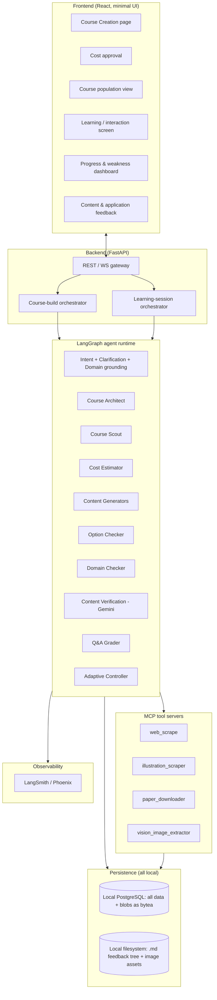
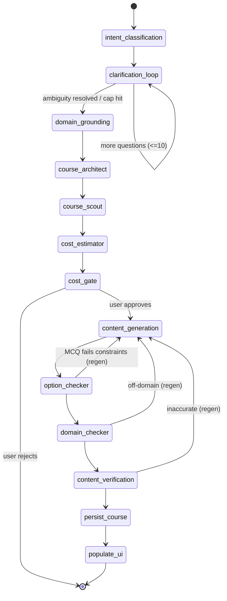
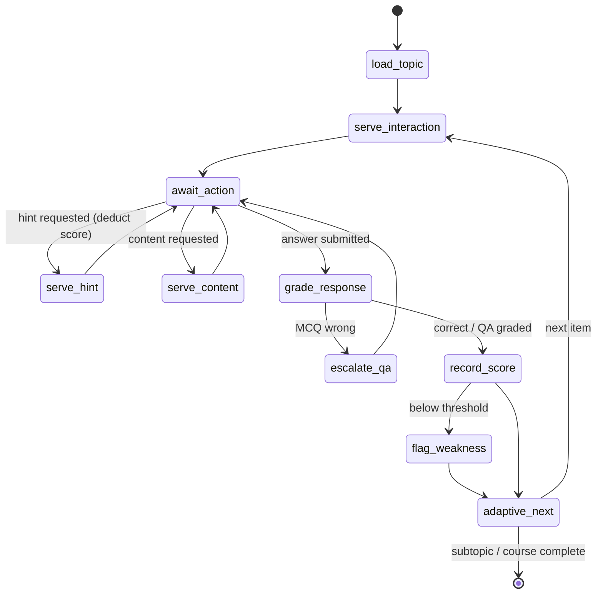

# 02 — Architecture & Orchestration

## 1. System at a glance



Two orchestrated flows drive everything:

- **Course-build graph** — offline-ish pipeline (intake → curriculum → sources → cost gate →
  generation → checks → persist). Human-in-the-loop pauses at clarification and at cost approval.
- **Learning-session graph** — the runtime loop a learner drives.

---

## 2. Course-build graph (LangGraph)



- **`clarification_loop`** and **`cost_gate`** are `interrupt()` points — the graph pauses and
  waits for a user response, then resumes. Use LangGraph's checkpointer (Postgres-backed) so
  builds survive restarts and can be resumed.
- **`content_generation`** fans out over subtopics and runs in parallel; each item then passes
  through the three checkers. Each checker can bounce an item back for regeneration with a
  **max retry** (default 2) before flagging it for human review rather than blocking the build.
- Every node writes traces to observability and metrics (tokens, latency) to Postgres.

### Build state object (`BuildState`)
```python
class BuildState(TypedDict):
    course_context: CourseContext          # from 01
    curriculum: Curriculum | None           # topics -> subtopics, per-topic calibrated DL
    source_manifest: dict[str, list[Source]]  # subtopic_id -> sources
    cost_estimate: CostEstimate | None
    cost_approved: bool
    generated: dict[str, list[Interaction]]   # subtopic_id -> interactions
    check_failures: list[CheckFailure]
    metrics: BuildMetrics                     # timing + token accounting
```

---

## 3. Learning-session graph (LangGraph)



- The **first** `serve_interaction` for any topic is always the **definition MCQ** (see
  `04-interaction-and-scoring.md`).
- `escalate_qa` fires immediately on a wrong MCQ: a Q&A on the same subtopic is served and
  graded by the **Q&A Grader** agent.
- `adaptive_next` chooses the next interaction's DL and subtopic using recent performance and
  the weakness set (see `04`).

### Session state object (`SessionState`)
```python
class SessionState(TypedDict):
    session_id: str
    user_id: str
    course_id: str
    current_subtopic: str
    current_interaction: Interaction
    current_dl: int                # 1..3, adapts over the session
    hints_used_this_item: int
    running_score: int
    weakness_counts: dict[str, int]  # subtopic -> error count
```

---

## 4. Tech stack (recommended, tuned to your existing environment)

| Layer | Choice | Rationale |
|-------|--------|-----------|
| Orchestration | **LangGraph** (Python) | You already signalled openness; native checkpointing + HITL interrupts fit the cost/clarify gates. |
| Backend API | **FastAPI** | Pairs cleanly with LangGraph; async for streaming generation + WS learning sessions. |
| Frontend | **React** | Matches your existing platform stack. Minimal styling (see `07`). |
| DB | **Local PostgreSQL** (+ `pgvector` optional) | Single local instance holds all structured data **and** binary blobs (bytea). pgvector later if you want semantic search over scraped sources. |
| Blob storage | **Postgres `bytea`** behind a `BlobStore` interface | Diagrams, extracted figures, and uploaded feedback images live in Postgres for now. The interface keeps a local-dir or S3 backend swappable later without touching callers. |
| Feedback files | **Local filesystem** (`./data/feedback/…`) | The required `.md` feedback tree + linked image assets are written to a configurable local directory. |
| Tooling | **MCP servers** (one per tool family) | Required by spec; keeps scraping/vision swappable. |
| Build model | **GLM 5.2** (configurable) | Your target build/codegen model; content generation model is configurable per-agent. |
| Verification model | **Latest Gemini** (pin at build time) | Independent model for accuracy checking. |
| Observability | **LangSmith primary, Phoenix (Arize) pluggable** | See `06-data-and-feedback.md` for the decision + abstraction. |
| Hosting | **Local (single machine)** | Everything runs locally for now — no cloud dependency. |

**Model configuration is per-agent** (see `03-agents.md`), read from a single `models.yaml`,
so you can swap GLM/Gemini/others without touching agent code. Never hardcode model IDs in
agent logic.

---

## 5. Cross-cutting rules

- **Idempotent regeneration.** Regenerating one interaction must not mutate siblings. Content
  is addressed by stable `interaction_id`.
- **Everything is captured.** Every agent call records tokens in/out, latency, model, and
  cost to Postgres (`generation_metrics`) in addition to observability traces — the spec
  explicitly requires capturing *generation speed*.
- **Checkers gate, they don't silently pass.** A checker either approves, requests regen
  (within retry budget), or escalates to human review — never drops an item.
- **HITL is first-class.** Clarification and cost approval are real graph pauses, not
  fire-and-forget prompts.
