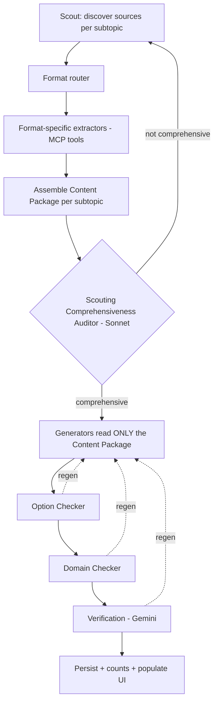

# 05 — Content Pipeline & MCP Tools

**This is the most important part of the application.** Course quality is bounded by how
comprehensively content is scouted, how faithfully it's extracted from every source format,
and how cleanly that material is handed to generation. This module therefore specifies:

1. a broad, extensible **MCP tool catalog** (many formats, not just web pages),
2. a **format router** so the right extractor is used per source,
3. a strong **Scout → Generation handoff** (the *Content Package*) so there is **no
   disconnect** between the scouting agent and the generating agent,
4. a **Scouting Comprehensiveness Auditor** (Sonnet-class LLM) that gates the pipeline until
   scouting is genuinely comprehensive, and
5. the **counts** surfaced on the curriculum/population page.

---

## 1. Pipeline overview



The **Auditor loop** is the key new gate: generation cannot start for a subtopic until its
Content Package is judged comprehensive. Generation then reads **only** from the Content
Package, never re-scraping — that's what guarantees scout/generation stay in sync.

---

## 2. MCP tool catalog (extensible)

Web/vision/extraction capability is exposed through **MCP servers**, grouped by family so
each is independently swappable and callable by any agent. The catalog is **open-ended** —
adding a new format = adding a new extractor tool behind the router, without touching agents.

All tools return **references** (`blobs.id` in local Postgres, via the `BlobStore` interface)
for binaries and **structured text** for extracted content. Every call is traced and its
latency/tokens/cost recorded.

### Discovery
| Tool | Purpose |
|------|---------|
| `web_search` | Search the live web; returns ranked results + dates. |
| `web_scrape` | Fetch + clean a page's prose. |
| `paper_search` | Search arXiv/conference/DOI indexes, date-filterable for "recent". |

**`web_search` must use a real, high-quality search provider — not a scrape-the-first-engine
hack.** Weak/generic search (e.g. bare DuckDuckGo) returns off-topic junk on acronym-colliding
queries (e.g. "MCP" → unrelated results), which poisons the whole pipeline. The primary
backend is a proper AI-grade web search (this build uses **OpenRouter's built-in web search
plugin, Exa-backed**, reached with the OpenRouter key already used for models); it returns
on-topic primary sources (official docs, reputable blogs, papers) with real per-call cost that
is recorded to `generation_metrics`. A keyless fallback (DuckDuckGo + Wikipedia, junk-filtered)
keeps scouting working if the provider is unavailable. The provider is swappable behind the
`web_search` tool; agents never change.

### Fetch
| Tool | Purpose |
|------|---------|
| `paper_downloader` | Download a paper (arXiv id / DOI / url) → PDF ref + metadata. |
| `file_fetcher` | Download an arbitrary document by url → blob ref + detected MIME. |

### Format-specific extractors (the important, growing set)
| Tool | Handles | Extracts |
|------|---------|----------|
| `pdf_extractor` | PDF (papers, reports, whitepapers) | text, sections, tables, figure regions, references |
| `slides_extractor` | PPTX / Google Slides / Keynote-exported | per-slide text, speaker notes, embedded images/diagrams |
| `doc_extractor` | DOCX / ODT / RTF | headings, body text, tables, embedded images |
| `html_article_extractor` | article/blog/doc pages | main content, headings, code blocks, captions |
| `illustration_scraper` | image-heavy pages | clean illustrations/diagrams + captions + alt + license hint |
| `vision_image_extractor` | any PDF/image | figures/diagrams + captions + kind (diagram/chart/photo) via a vision model |
| `transcript_extractor` | video/audio/YouTube | timestamped transcript, chapter/segment structure |
| `notebook_extractor` | Jupyter `.ipynb` | markdown cells, code cells, output figures |
| `table_extractor` | PDFs/pages/spreadsheets | structured tables (rows/cols) as data, not prose |
| `code_repo_reader` | Git repos / gists | README, key modules, docstrings (for technical courses) |
| `ocr_tool` | scanned/image documents | text from non-selectable content |

**Contract shape (all extractors):**
```
input:  { ref | url : str, hints?: {...} }
output: {
  source_id: str,
  mime: str,
  text_chunks: [{ id, text, section?, page?, ordinal }],
  figures:     [{ image_ref, caption?, page?, kind, license_hint? }],
  tables:      [{ id, rows, caption? }],
  citations:   [{ text, url? }],
  meta:        { title?, authors?, published?, license_hint? }
}
```

**Rules**
- Extractors are **pure**: given a ref they return structured content; they don't decide
  relevance (that's the Scout/Auditor).
- Respect `robots.txt` and licensing; always populate `license_hint` so figure reuse can be
  decided downstream.
- Blocked-domain / auth-wall failures return a clear structured error, never a silent empty.

### Format router
A lightweight component (not an LLM) maps a fetched source's detected MIME/type to the correct
extractor(s). A single source can trigger several (e.g. a PDF → `pdf_extractor` **and**
`vision_image_extractor` for figures). Unknown formats fall back to `file_fetcher` + best-effort
`ocr_tool`/`vision_image_extractor` and are flagged for review.

---

## 3. Scout → Generation handoff: the **Content Package**

To eliminate any disconnect between scouting and generation, the Scout does **not** hand over a
list of URLs. It hands over a fully-assembled, self-contained **Content Package** per subtopic
containing everything the generators need. Generators are **forbidden** from re-scraping; they
read only the Package. If the Package lacks something, that's an Auditor failure, not a
generation-time scramble.

```json
// ContentPackage (one per subtopic)
{
  "subtopic_id": "...",
  "coverage_map": {                       // what the subtopic requires vs what we have
    "required_concepts": ["...", "..."],
    "covered_concepts":  ["...", "..."],
    "gaps":              ["..."]
  },
  "sources": [{
    "source_id": "...", "url": "...", "type": "paper|slides|doc|article|video|repo|illustration",
    "title": "...", "published": "2026-05-01", "license_hint": "...", "relevance": 0.0
  }],
  "extracted": {
    "text_chunks": [{ "id": "...", "source_id": "...", "text": "...", "section": "...", "page": 3 }],
    "figures":     [{ "image_ref": "...", "source_id": "...", "caption": "...", "kind": "diagram" }],
    "tables":      [{ "id": "...", "source_id": "...", "rows": [ ] }],
    "key_claims":  [{ "text": "...", "source_id": "...", "confidence": 0.0 }],
    "definitions": [{ "term": "...", "definition": "...", "source_id": "..." }]
  },
  "domain_grounding": { /* copied from CourseContext so generators frame correctly */ },
  "target_question_count": 5,
  "recency": { "mode": "fundamentals|latest_research", "newest_source": "2026-06-01" }
}
```

Generators receive `ContentPackage` + `IntentProfile`. Because definitions, figures, tables and
key claims are already extracted and attributed to a `source_id`, generated questions can cite
provenance, and the **Verification agent** can check each claim back to its source.

---

## 4. Scouting Comprehensiveness Auditor (Sonnet-class LLM)

Scouting must be **really** comprehensive; a separate, strong LLM audits it before generation.

**Model:** Sonnet-class (independent from the Scout's model), configured in `models.yaml`.

**Checks per subtopic Content Package:**
- **Concept coverage** — are all `required_concepts` for this subtopic actually covered by the
  extracted material? Flag `gaps`.
- **Source diversity** — not over-reliant on a single source or a single format; mix of primary
  sources where appropriate.
- **Depth** — is the material deep enough to author questions up to the subtopic's DL (a DL3
  subtopic needs deeper material than a DL1 one)?
- **Recency** — if `latest_research`, are sources actually recent (date-checked)?
- **Figure availability** — are there enough diagrams/figures to satisfy the "diagrams in
  questions" requirement?
- **Contradictions** — note conflicting claims across sources for the generator/verifier.

**Output:**
```json
{
  "comprehensive": false,
  "score": 0.0,
  "gaps": ["missing concept X", "no recent source after 2026-03", "no diagram for Y"],
  "recommended_actions": [
    {"action": "scout_more", "query_hint": "...", "reason": "..."},
    {"action": "fetch_format", "format": "slides", "reason": "..."}
  ]
}
```

**Loop:** if `comprehensive = false`, the Scout re-runs with the recommended actions
(additional searches, new formats, more recent sources). Bounded by `MAX_SCOUT_ROUNDS`
(default 3); if still short, the subtopic is flagged in the population UI as *partially
sourced* rather than silently generating thin content.

---

## 5. Live-web "stay current" path

When `currency_mode = latest_research` (e.g. *"stay updated on recent RL topics"*):

1. `paper_search` (date-filtered) finds **recent** papers per subtopic.
2. `paper_downloader` fetches them.
3. `pdf_extractor` + `vision_image_extractor` pull text **and real figures** from the papers.
4. The Auditor specifically enforces the **recency** and **figure-availability** checks.
5. Generators build from the Content Package; Verification (Gemini) checks claims against the
   extracted source material.

Real paper figures can therefore be attached to questions, with provenance recorded.

---

## 6. Diagram handling

- Prefer **sourced** figures (from the Content Package's `figures`) over generated ones.
- If a needed diagram is missing, generate a simple **SVG schematic**; record provenance
  (`sourced` + source_url + license_hint, or `generated`).
- Diagrams attach to **questions only**, never to MCQ options.
- Stored as blobs in local Postgres; interactions reference `diagram_ref`.

---

## 7. Checkers (full contracts in `03-agents.md`)

| Checker | Guarantees |
|---------|-----------|
| **Option Checker** | 4 options; answer position varied; correct/incorrect lengths balanced in aggregate; plausible distractors; text-only options |
| **Domain Checker** | Content framed in the persona's domain grounding; regen if drifted |
| **Content Verification (Gemini)** | Factual accuracy of answers, definitions, content panels — checked against Content Package sources, independent model family |

---

## 8. Population / curriculum output (counts)

After persistence, the **curriculum / population view** (`07-frontend-ui.md`) shows, per
subtopic **and** as course-level totals:
- name + description,
- **number of MCQs**,
- **number of Q&A items**,
- **number of illustrations/diagrams used** (sourced vs generated),
- **number of sources used** (and formats: papers/slides/docs/video/…),
- newest source date (recency),
- items **flagged for human review** or subtopics marked **partially sourced** by the Auditor.

These counts are computed from persisted rows (see `06-data-and-feedback.md §4`) and are the
tester's at-a-glance measure of how substantial the course is.

---

## 9. Build-event trace (testing observability)

Every meaningful step of the build pipeline emits a **build event** — persisted to
`build_events` (`06 §1`) so the population page can stream a **live technical log** while a
background build runs. Emit at least: search provider + query + result count, each MCP
extractor call and its source URL + chunk count, the Scouting Auditor score and each
scout-again round, each generated interaction, each Domain/Verification/Option check with its
verdict (pass / regen / flagged), persistence, and cost reconciliation. Events are phase-tagged
(`intake|scouting|generation|checking|verification|persist|cost`) and are deliberately
low-level for the test phase. This is separate from the LangSmith/Phoenix trace (`06 §3`): the
build-event log is the tester-facing UI stream; observability traces are for offline analysis.
